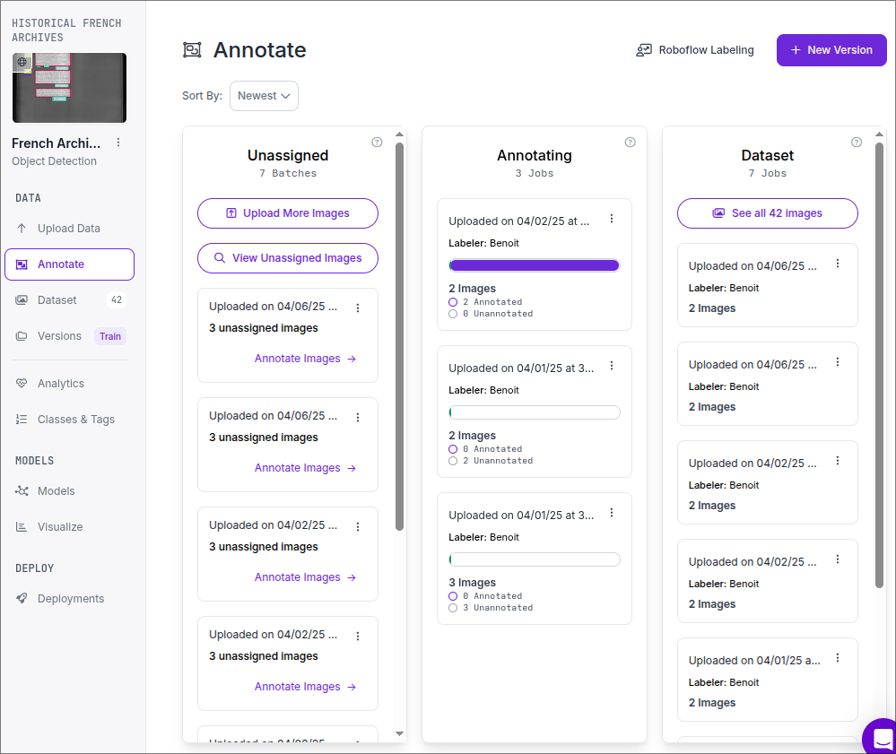
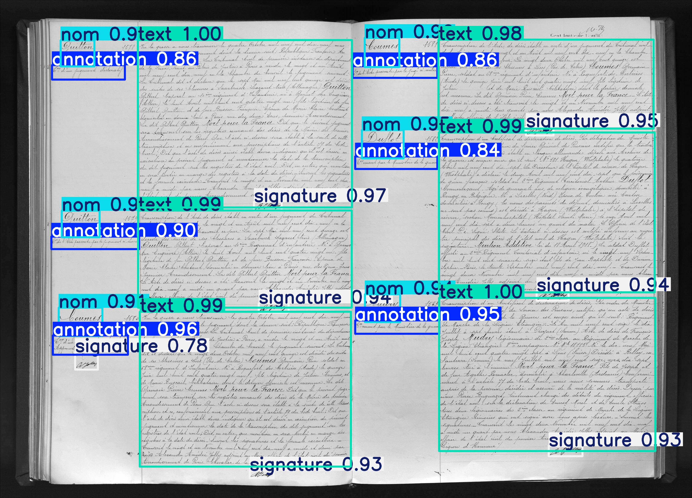
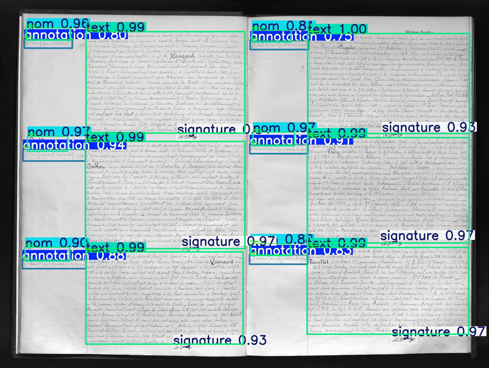

# Etat Civil

## Introduction

The Etat Civil project is designed to digitize and process historical civil records from archives. By leveraging modern techniques such as web scraping, image processing, and OCR, this pipeline transforms scanned documents into structured datasets for further analysis.

## Overview of Pipeline Components


The pipeline, depicted in the image above, encompasses four fundamental stages:

- **Web scraping:** The first step it's to gather all the needed page from archives.paris.fr

- **Parsing Layout:** The second stage involves layout parsing, wherein global images are segmented into smaller units, each containing a single line of text.

- **Group by person:** Then, to create the final dataset, we need to group the layouts by person.

- **Optical Character Recognition (OCR) Module:** In the final stage, the OCR module takes center stage, transcribing individual images into text.

## Web scraping

The web scraping process is the first step in the pipeline. It involves programmatically accessing the archives website (`archives.paris.fr`) to retrieve the necessary pages and images. Using tools like `splinter` and `requests`, the script automates browser interactions to navigate through pages, extract image URLs, and download the images. These images serve as the raw input for subsequent stages of the pipeline.

This illustrate how the script automates the scraping process, ensuring efficient and systematic data collection:

1. **Generating the URL for Each Page**:
   ```python
   # filepath: /home/anolys/Repository/EtatCivil/src/extract_imgs.py
   to_encode = 'a:4:{s:4:"date";s:10:"2025-03-26";s:10:"type_fonds";s:11:"arko_seriel";s:4:"ref1";i:4;s:4:"ref2";i:'+str(i)+';}'
   url = "https://archives.paris.fr/arkotheque/arkotheque_visionneuse_archives.php?arko=" + base64.b64encode(to_encode.encode()).decode('utf-8')
   ```

   This snippet dynamically generates the URL for each page by encoding specific parameters using `base64`.

2. **Extracting and Downloading Images**:
   ```python
   # filepath: /home/anolys/Repository/EtatCivil/src/extract_imgs.py
   img_url = browser.find_by_id("image1")['src']
   if img_url != "//:0":
       cookies, headers = get_request_headers(browser, url)
       download_image(img_url, data_dir, cookies, headers)
   ```

   The script locates the image URL on the page, retrieves the necessary cookies and headers, and downloads the image using the `download_image` function.

3. **Navigating Through Pages**:
   ```python
   # filepath: /home/anolys/Repository/EtatCivil/src/extract_imgs.py
   next_button = browser.find_by_id("arkoVision_next")
   next_button.click()
   is_last_page = 'desactive' in next_button['class']
   ```

   After processing the current page, the script clicks the "Next" button to move to the next page and checks if it has reached the last page.

## Parsing Layout

The layout parsing stage is crucial for segmenting the global images into smaller units. This step ensures that the subsequent OCR process can focus on each part, improving accuracy and efficiency.

### Annotation

Roboflow is utilized to streamline the image annotation process. It provides tools to label and prepare datasets for training object detection models, such as YOLO.



Roboflow provides a centralized workspace where all group members can access and contribute to the annotation process, ensuring that everyone works on the same dataset and avoiding duplication of effort. Changes made by one member are immediately reflected in the shared workspace, enabling real-time collaboration. With role-based access control, the project owner can assign specific roles, such as annotator or reviewer, to team members, streamlining the workflow. Additionally, Roboflow maintains version history for datasets, making it easy to track changes and revert to previous versions if needed.

### YOLO Training

Google Colab is used to train and test the YOLO model due to its high-performance GPU capabilities. The annotated dataset is downloaded from Roboflow in a YOLO-compatible format.

After preparing the dataset, the YOLO model is trained using the downloaded data. The training command specifies the model architecture, dataset configuration, number of epochs, and image size. The command `!yolo detect train model=yolo11n.pt data=/content/French-Archives-1/data.yaml epochs=60 imgsz=1280` trains the YOLO model with 60 epochs and an image size of 1280 pixels. 

Once the training is complete, the model is evaluated on the validation dataset to assess its performance. The evaluation is performed using the command `!yolo detect predict model=/content/runs/detect/train5/weights/best.pt source=/content/French-Archives-1/test/images`, which applies the trained model to the test images and generates predictions. The trained YOLO model is then used in the layout parsing stage to detect and classify bounding boxes for text lines, signatures, and other elements in the images.

The result of the Layout parsing process:


## Group by person

The "Group by person" stage is essential for associating detected bounding boxes with individual persons. This step ensures that the final dataset is structured in a way that groups all relevant information, such as text lines and signatures, for each person.

The process begins by analyzing the bounding boxes detected by the YOLO model. Each bounding box is checked for its position on the left or right side of the image using the `check_side` function. This function calculates the center of the bounding box and determines its side based on the image width:

```python
# filepath: /home/anolys/Repository/EtatCivil/src/layout_parsing.py
def check_side(box, image_width):
    center_x = (box[0] + box[2]) / 2
    return "left" if center_x < 0.5 * image_width else "right"
```

Bounding boxes are then grouped into "persons" based on their spatial relationships. The `overlapping_height` function calculates the overlap between bounding boxes to determine if they belong to the same person:

```python
# filepath: /home/anolys/Repository/EtatCivil/src/layout_parsing.py
def overlapping_height(box1, box2):
    overlap_y = max(0, min(box1[3], box2[3]) - max(box1[1], box2[1]))
    min_height = min(box1[3] - box1[1], box2[3] - box2[1])
    return overlap_y / min_height
```

Using these relationships, bounding boxes are grouped into lists, where each list represents a single person. The `find_topmost_and_bottommost` function identifies the topmost and bottommost persons on each side of the image. This ensures that critical information, such as names, is included in the dataset:

```python
# filepath: /home/anolys/Repository/EtatCivil/src/layout_parsing.py
def find_topmost_and_bottommost(persons):
    for idx, person_boxes in enumerate(persons):
        for box in person_boxes:
            # Logic to find topmost and bottommost persons
            ...
    return topmost_left, topmost_left_index, topmost_right, topmost_right_index, bottommost_left, bottommost_left_index
```

Finally, the grouped data is validated to ensure that each person has the required information, such as a "nom" class. If necessary, bounding boxes are merged or removed to maintain data integrity. The results are saved as JSON files for further processing:

```python
# filepath: /home/anolys/Repository/EtatCivil/src/layout_parsing.py
save_json_data(os.path.join(output_dir, 'pers', filename.replace('.jpg', '.json').replace('.png', '.json')), persons)
```

This stage transforms raw bounding box data into a structured format, enabling the creation of a final dataset that groups all relevant information by person.

The result of the grouping stage:


## Optical Character Recognition (OCR) Module

The Optical Character Recognition (OCR) module is the final stage of the pipeline, responsible for transcribing individual images into text. This step is critical for converting the segmented layouts into structured textual data that can be analyzed further.

Currently, this part of the pipeline is not fully implemented due to the difficulty in finding pre-trained OCR models specifically designed for French manuscripts. Most available OCR models are trained on modern printed text or non-French languages, making them unsuitable for accurately recognizing historical French handwriting.

To address this challenge, we plan to manually train an OCR model using a dataset of annotated French manuscripts. This involves collecting a sufficient number of labeled samples, preprocessing the data, and training the model using frameworks such as Tesseract or PyTorch-based OCR libraries. The manual training process will ensure that the model is tailored to the unique characteristics of historical French handwriting, improving its accuracy and reliability.

Until the model is trained, the OCR module remains incomplete, and manual transcription may be required for certain datasets.

## Conclusion

The Etat Civil project represents a significant step forward in digitizing and analyzing historical civil records. By integrating modern techniques such as web scraping, layout parsing, and OCR, the pipeline transforms raw archival images into structured datasets, enabling deeper insights into historical data. While the OCR module is still under development, the project's modular design ensures that each stage can be improved independently. Future advancements, such as training a custom OCR model for French manuscripts, will further enhance the pipeline's accuracy and usability, making it a valuable tool for historians, researchers, and archivists.